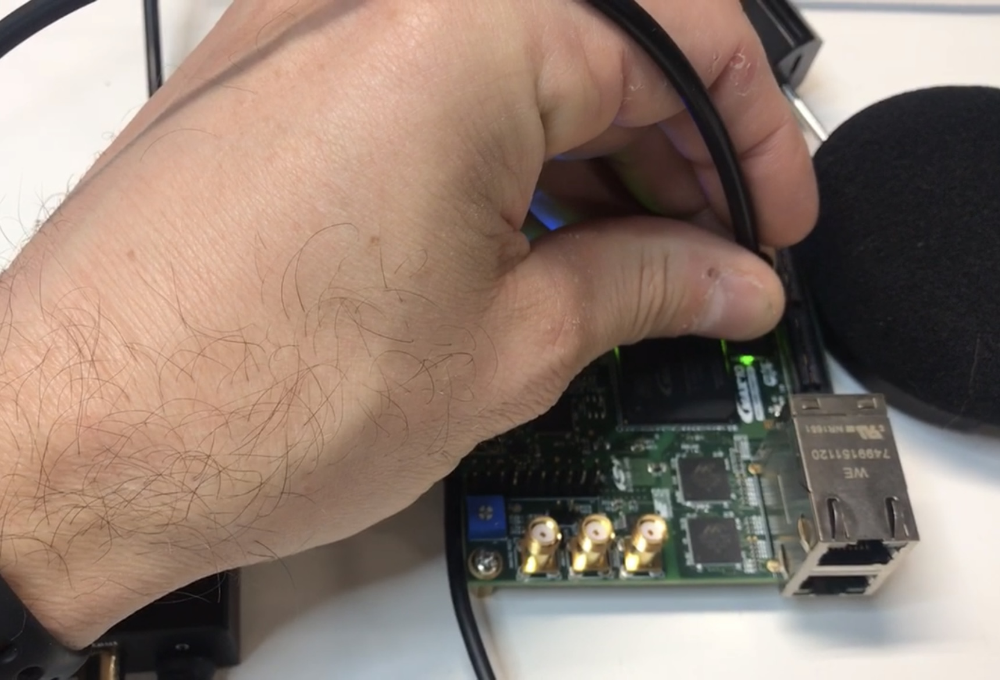
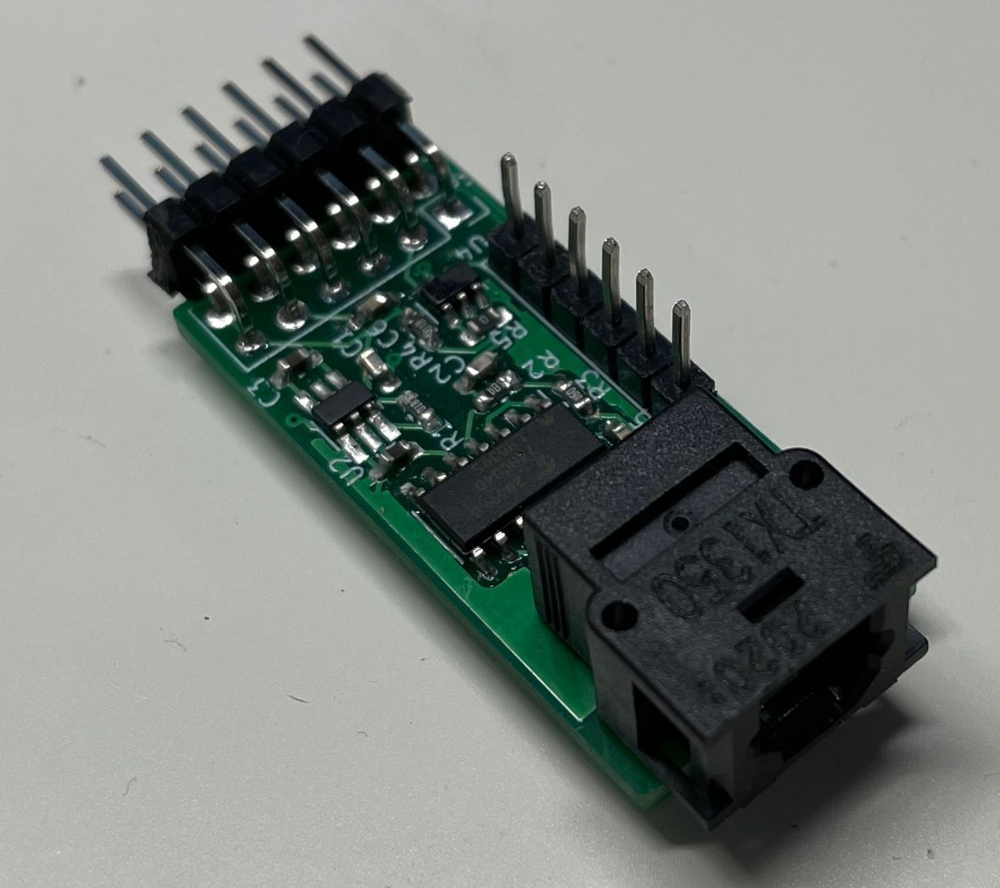
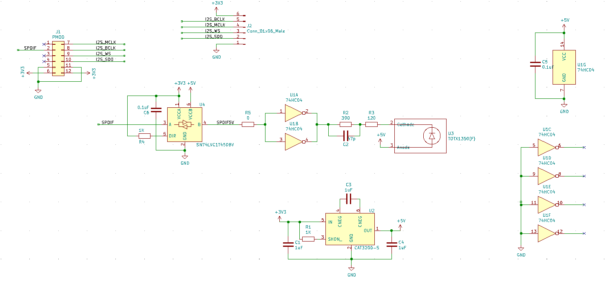
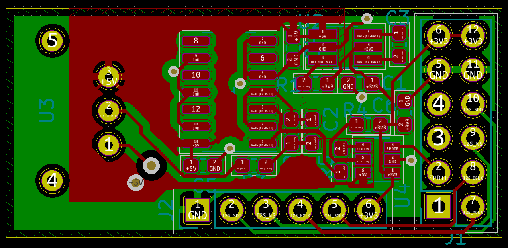
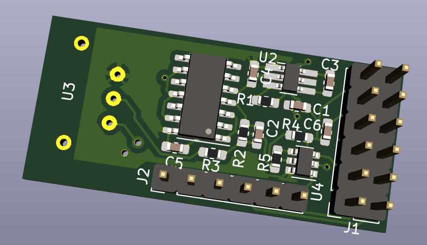

# S/PDIF Output PMOD

Analog design isn't my strength, so when I do audio experiments with an FPGA, I prefer to
send out the audio signal in digital format. 

S/PDIF (optical and coaxial) in to analog converters (line out and headphone out) can
be found on Amazon for ~$10. These work fine with pretty much an LED on a development
board. In theory, you don't even need a special interface: it will work 
[as long as you hold the optical cable right above the LED](https://twitter.com/tom_verbeure/status/1299565313797750784?s=20)!

But that's obviously not a long term solution.

This little S/PDIF output PMOD board solves that:

In additional to an S/PDIF output, the board also has 4 GPIOs. I've given the pins the
names of an I2S interface, but since they go straight to the PMOD pins, you can use
them for anything.

The total cost is around ~$30:

* PCB (JLCPCB): $2 + $14 shipping (for 5 PCBs)
* TOSLink connecter: $10
* All the rest: ~$4

The board was designed with KiCAD.

(I handsoldered it and it looks terrible, but it works...)

## Schematic

[Schematic in PDF format](pcb/pmod_spdif/pmod_spdif.pdf)

## PCB

