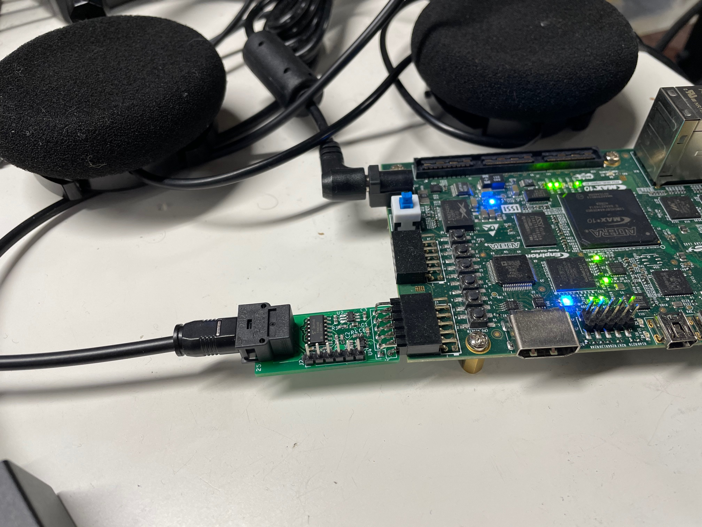
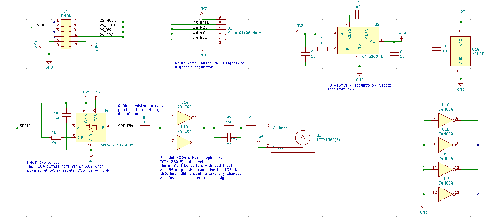
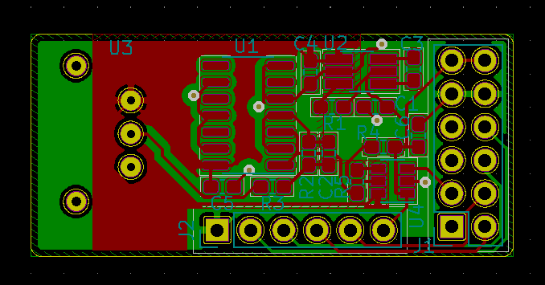
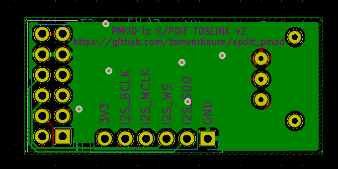
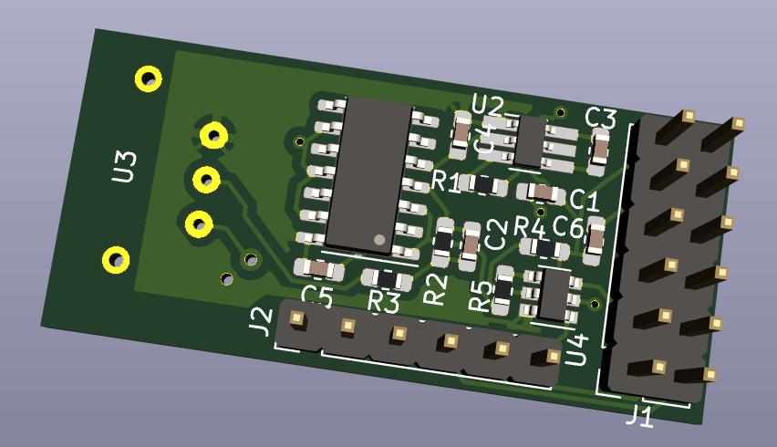
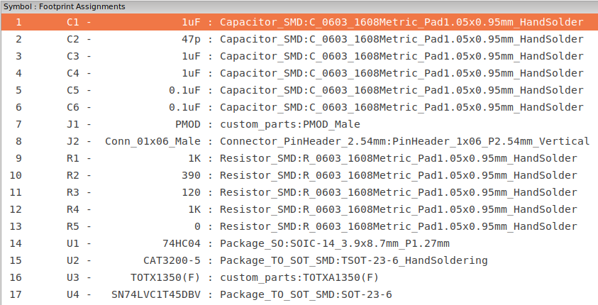

# S/PDIF Optical Output PMOD

* [My blog post about this project](http://tomverbeure.github.io/2021/01/18t/SPDIF-Output-PMOD.html)

Features:

* S/PDIF optical output (TOSLINK)
* 4 GPIOs

The total cost is around ~$30:

* PCB (JLCPCB): $2 + $14 shipping (for 5 PCBs)
* TOSLink connecter: $10
* All the rest: ~$4

## SPDIF Board

The board was designed with [KiCAD](https://kicad.org/).

**Schematic**

[Schematic in PDF format](pcb/pmod_spdif/pmod_spdif.pdf)

**PCB**

**Component list**

## Example Design

The PMOD was tested on an [Intel Max10 development board](https://www.intel.com/content/www/us/en/programmable/products/boards_and_kits/dev-kits/altera/max-10-fpga-development-kit.html), 
but it should be trivial to make it work on any FPGA board that has a PMOD connector.

The [RTL](blob/main/fpga/spinal/src/main/scala/spdif/SpdifOut.scala) is written in 
[SpinalHDL](https://spinalhdl.github.io/SpinalDoc-RTD/), which gets converted into Verilog.

There's also a small [testbench](tree/main/fpga/tb/spdif) that uses 
[CXXRTL](https://tomverbeure.github.io/2020/08/08/CXXRTL-the-New-Yosys-Simulation-Backend.html) 
to simulate the whole thing. The testbench is not self-checking. You'll need to eyeball the waveforms to verify
that things are working...

The Max10 design uses a PLL to create a 6.144MHz clock out of the 50MHz oscillator clock.

