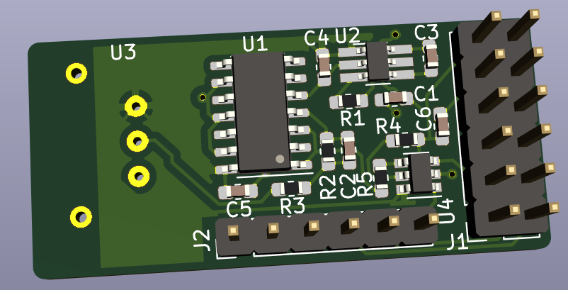

# S/PDIF Output PMOD

Analog design isn't my strength, so when I do audio experiments with an FPGA, I prefer to
send out the audio signal in digital format. 

S/PDIF to analog converters can be found on Amazon for ~$10. 

These work fine with pretty much any LED on a development board. You don't even need a special 
interface: [just hold the optical cable right above the LED](https://twitter.com/tom_verbeure/status/1299565313797750784?s=20)!

But that's obviously not a long term solution.

This little S/PDIF output PMOD board solves that:

(I handsoldered it and it looks terrible, but it works...)

It has an S/PDIF optical output (TOSLINK) and 4 GPIOs. I've given the GPIO pins the
names of an I2S interface, but since they go straight to the PMOD connector, you can use
them for anything.

The total cost is around ~$30:

* PCB (JLCPCB): $2 + $14 shipping (for 5 PCBs)
* TOSLink connecter: $10
* All the rest: ~$4

The board was designed with KiCAD.

## SPDIF Board

**Schematic**

[Schematic in PDF format](pcb/pmod_spdif/pmod_spdif.pdf)

**PCB**

**Component list**

## Example Design

The PMOD was tested on an Intel Max10 development kit, but it should be trivial to make it work
on any FPGA board that has a PMOD connector.

The RTL is written in SpinalHDL, which gets converted into Verilog.

There's also a small testbench that uses CXXRTL to simulate the whole thing. 
The testbench is not self-checking. You'll need to eyeball the waveforms to verify
that things are working...

